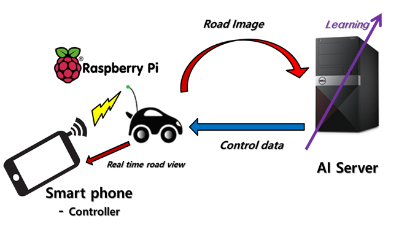

Automatic Driving RC Car using CNN
==================================

#### Developed by Kim KyungHwan, Lee KyungKeun, Ji YoungJin, Jang HyunWoo

### Stack
#### Python, Tensorflow, Android, RaspberryPi, Arduino
* Python : 인공지능 서버와 RC car, 안드로이드 컨트롤러 간의 socket 통신, RC car 컨트롤 구현
* Tensorflow : 주행 정보 학습을 위한 인공신경망 구현
* Android : RC car 원격 컨트롤러 구현
* RaspberryPi : RC Car 구현
* Arduino : 미니 신호등 구현

### Detail
* 센서를 사용하지 않고 카메라를 통한 이미지만을 이용해 자율주행 RC카를 만들었다.
* CNN을 이용해 카메라의 이미지의 특징을 얻고 그에 따른 주행 데이터를 출력으로 학습한다.
* 또한 색 인식 알고리즘과 haar classifier 알고리즘을 이용해 신호등 및 보행자를 인식한다.

